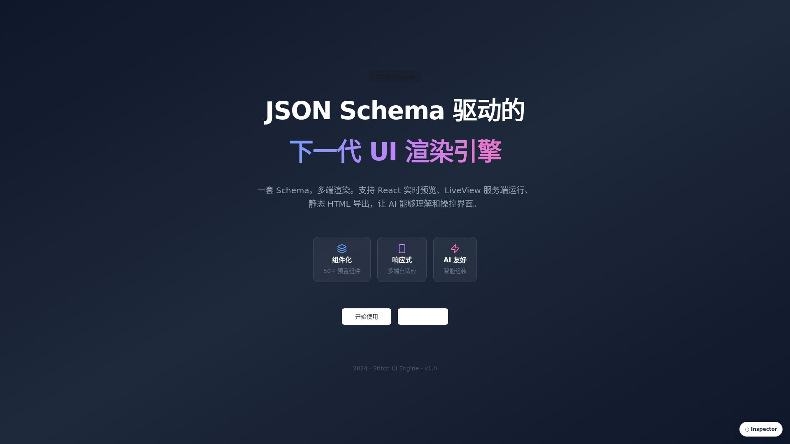
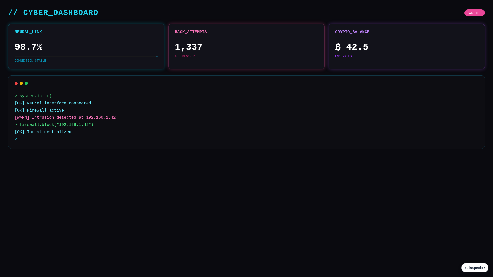
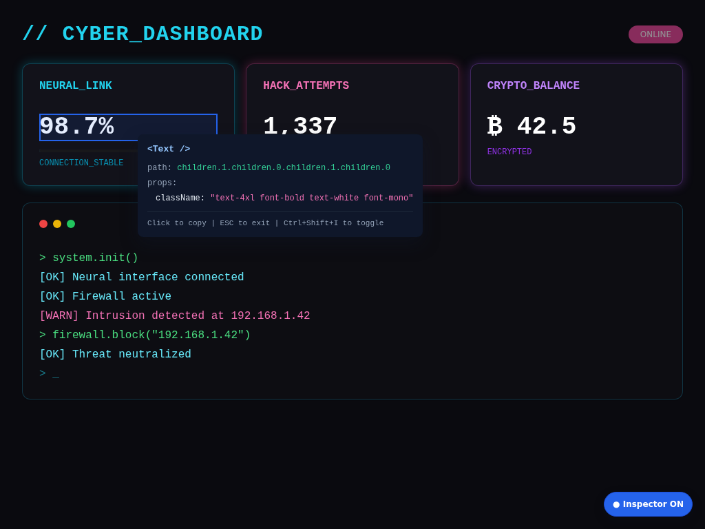

# Stitch UI

JSON Schema 驱动的 UI 渲染引擎。一套 Schema，多端渲染。

## 效果预览

**PPT 封面**



**Cyberpunk 风格**



## 在线演示（Web 版）

> 注：目前 Demo 为 Web 桌面端适配，移动端适配开发中。

👉 [查看所有 Demo](https://biantaishabi2.github.io/openstitch/demo/)

| Demo | 链接 |
|------|------|
| PPT 封面 | [ppt-cover](https://biantaishabi2.github.io/openstitch/demo/ppt-cover.html) |
| Cyberpunk 风格 | [cyberpunk](https://biantaishabi2.github.io/openstitch/demo/cyberpunk.html) |
| 后台仪表盘 | [admin-dashboard](https://biantaishabi2.github.io/openstitch/demo/admin-dashboard.html) |
| 技术路线图 | [tech-roadmap](https://biantaishabi2.github.io/openstitch/demo/tech-roadmap.html) |

## 特性

- **两种模式**
  - 渲染器：JSON Schema → React/LiveView 组件
  - 编译器：DSL 文本 → 静态 HTML + CSS（自动生成视觉样式）
- **50+ 预置组件**：布局、表单、数据展示、反馈等
- **AI 友好**：DSL 格式简洁，便于 AI 生成；视觉引擎自动处理样式
- **确定性输出**：相同 context + seed = 相同视觉风格

## 两种模式

| 模式 | 输入 | 输出 | 适用场景 |
|------|------|------|----------|
| **渲染器 (Renderer)** | JSON Schema | React/LiveView 组件 | 精确控制每个组件属性 |
| **编译器 (Compiler)** | DSL 文本 | 静态 HTML + CSS | AI 生成、快速原型 |

## 项目结构

```
stitch/
├── src/
│   ├── components/ui/        # React 组件 (shadcn/ui)
│   ├── data/schemas/         # JSON Schema 示例
│   ├── lib/renderer/         # React 渲染器
│   └── lib/compiler/         # DSL 编译器 (新)
│       ├── logic/            #   DSL 解析器
│       ├── visual/           #   视觉引擎 (Token 生成)
│       ├── factory/          #   组件工厂
│       ├── ssr/              #   SSR 渲染器
│       └── config/           #   外部化配置
├── packages/
│   └── liveview/             # Elixir/LiveView 组件包
├── scripts/
│   └── export-static.tsx     # 静态 HTML 导出工具
└── docs/                     # 文档
```

---

## 编译器模式 (Compiler)

编译器将 DSL 文本编译为完整的静态 HTML，自动生成视觉样式。

### 编译流程

```
DSL 文本 → 解析器 → AST → 视觉引擎 → Design Tokens → 组件工厂 → IR → SSR → HTML
```

### CLI 使用

```bash
# 编译 DSL 文件
npx stitch compile input.dsl -o output.html

# 指定上下文（影响视觉风格）
npx stitch compile input.dsl --context "金融交易系统"

# 指定 seed（确保样式可复现）
npx stitch compile input.dsl --seed 12345
```

### DSL 语法示例

```
Page {
  Header { justify="between" align="center"
    Text { "Logo" variant="title" }
    Nav {
      Link { "首页" href="/" }
      Link { "关于" href="/about" }
    }
  }
  Section {
    Card {
      Text { "标题" variant="title" }
      Text { "这是卡片内容" }
      Button { "点击" variant="primary" }
    }
  }
}
```

### 视觉引擎

编译器根据 context 自动生成 Design Tokens：

| 场景 | 关键词 | 视觉特征 |
|------|--------|----------|
| 技术 | 系统、架构、API | 锐利圆角、无装饰 |
| 金融 | 银行、交易、财务 | 极小圆角、涨跌色 |
| 医疗 | 医院、健康、诊断 | 大圆角(8px+)、柔和 |
| 教育 | 学习、儿童、课程 | 胶囊圆角、活泼色彩 |
| 创意 | 设计、营销、品牌 | 丰富装饰、高饱和 |

### 配置文件

视觉参数可在 `src/lib/compiler/config/` 中调整：

| 文件 | 内容 |
|------|------|
| `scene.json` | 场景关键词、约束（饱和度、明度、语义色） |
| `typography.json` | 字阶比率、字号范围、字重 |
| `shape.json` | 圆角风格、阴影强度 |
| `ornament.json` | 装饰模式、透明度级别 |
| `component-props.json` | 组件默认 Props |

---

## 渲染器模式 (Renderer)

### 方式一：React 渲染器（导出静态 HTML）

### 快速开始

```bash
git clone git@github.com:biantaishabi2/openstitch.git
cd openstitch
npm install

# 启动开发服务器预览
npm run dev

# 导出静态 HTML
npx tsx scripts/export-static.tsx
```

## 添加新页面

1. 在 `src/data/schemas/` 目录下创建 JSON 文件，例如 `my-page.json`
2. 运行导出命令生成静态 HTML

## 静态 HTML 导出

导出工具会自动扫描 `src/data/schemas/` 目录下的所有 JSON 文件。

```bash
# 导出所有页面
npx tsx scripts/export-static.tsx

# 查看所有可用的 schema
npx tsx scripts/export-static.tsx --list

# 只导出指定页面
npx tsx scripts/export-static.tsx ppt-cover

# 使用通配符导出
npx tsx scripts/export-static.tsx admin-*
```

导出的文件位于 `./output/` 目录。

### 方式二：LiveView 渲染器（Phoenix 项目）

### 安装组件包

在你的 Phoenix 项目的 `mix.exs` 中添加依赖：

```elixir
defp deps do
  [
    {:stitch_ui, git: "https://github.com/biantaishabi2/openstitch.git", sparse: "packages/liveview"}
  ]
end
```

然后运行：

```bash
mix deps.get
```

### 使用组件

```elixir
# 在你的 LiveView 或组件中
use StitchUI

# 然后就可以使用组件了
~H"""
<.card>
  <.card_header>
    <.card_title>标题</.card_title>
  </.card_header>
  <.card_content>
    <.text>内容</.text>
  </.card_content>
</.card>
"""
```

### 导出 JSON 为 HEEx

```bash
cd packages/liveview
mix stitch.export path/to/schema.json --output output.heex
```

这会把 JSON Schema 转换成使用 StitchUI 组件的 HEEx 模板。

---

## JSON Schema 格式

```json
{
  "type": "Card",
  "props": { "className": "p-4" },
  "children": [
    { "type": "Text", "children": "Hello World" }
  ]
}
```

### 支持的组件

**布局组件**: Flex, Stack, Grid, Container, Section, Page, Spacer, Div

**UI 组件**: Card, Button, Badge, Avatar, Input, Checkbox, Switch, Separator, Progress, Tabs, Dialog, Tooltip

**文本组件**: Text, Icon

**表格组件**: Table, TableHeader, TableBody, TableRow, TableHead, TableCell

## 示例 Schema

项目包含多个示例页面，位于 `src/data/schemas/` 目录：

| 示例 | 说明 |
|------|------|
| `ppt-cover.json` | PPT 封面页 |
| `admin-dashboard.json` | 后台管理仪表盘 |
| `admin-users.json` | 用户管理页面 |
| `tech-dashboard.json` | 技术监控面板 |
| `tech-roadmap.json` | 技术路线图 |
| `mobile-app.json` | 移动端应用页面 |
| `components-showcase.json` | 组件展示页 |

运行 `npx tsx scripts/export-static.tsx --list` 查看所有可用示例。

## Inspector - AI 协作工具

Inspector 是为 AI Agent 设计的协作工具。当你想让 AI 修改页面某个组件时，可以用 Inspector 快速获取组件信息，复制给 AI，让它知道要改哪里。

```bash
# 导出时注入 Inspector（外部脚本）
npx tsx scripts/export-static.tsx --inspector

# 导出时内联 Inspector（单文件）
npx tsx scripts/export-static.tsx --inspector-inline
```

**Inspector 效果：**



**使用流程：**
1. 点击右下角按钮启用检查模式
2. 点击你想修改的组件
3. 复制组件信息（类型、路径、属性）
4. 粘贴给 AI Agent，告诉它你想怎么改
5. AI 根据这些信息精准定位并修改 JSON Schema

## Claude Code Skills

本项目包含 Claude Code Skills，用于指导 AI 正确生成和渲染 Stitch UI 界面。

### 可用 Skills

| Skill | 用途 |
|-------|------|
| `stitch-planner` | 规划层决策逻辑：文本→组件选型、视觉层级、语义样式 |
| `stitch-renderer` | 执行层渲染规范：组件样式、布局规则、交互状态、响应式适配 |

### 使用方式

在 Claude Code 中引用 skill：

```bash
# 规划层：将文本内容转换为 UI 结构
@stitch-planner 把这段产品介绍转成落地页

# 执行层：实现具体的组件渲染
@stitch-renderer 帮我调整这个卡片的样式
```

### 规划层 (`stitch-planner`)

语义到视觉的映射矩阵：
- **逻辑结构→组件选型**：并列用Grid+Card、时序用Timeline、层级用List
- **信息密度→视觉层级**：核心观点用Hero、技术细节用CodeBlock、辅助说明用Caption
- **场景语义→色彩图标**：技术场景用蓝色系、成功用绿色、警告用黄色

### 执行层 (`stitch-renderer`)

组件渲染的原子规范：
- 8pt 网格系统、排版层级、色彩系统
- 组件行为规范（容器、导航、展示、反馈）
- 12列网格和堆叠布局
- 响应式断点（XL/L/M/S）
- 一致性检查规则

## 技术栈

**React 渲染器：**
- Next.js 15 + React 19
- shadcn/ui + Radix UI
- Tailwind CSS
- TypeScript

**LiveView 渲染器：**
- Elixir 1.14+
- Phoenix LiveView 1.0+
- Tailwind CSS

## License

MIT
